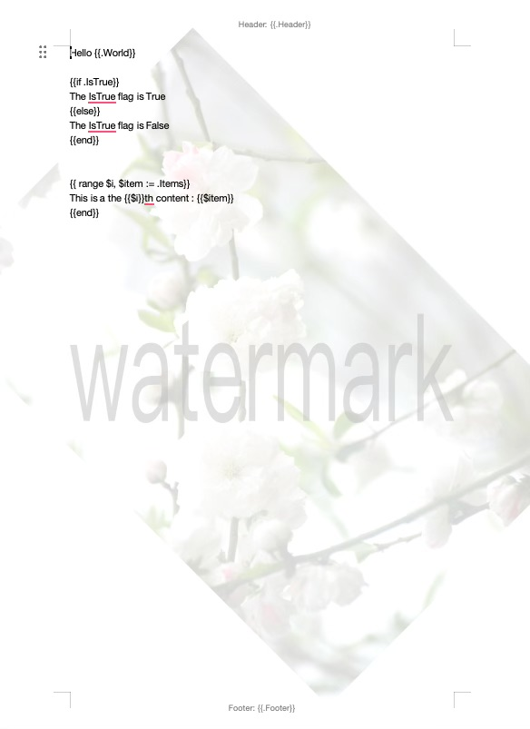
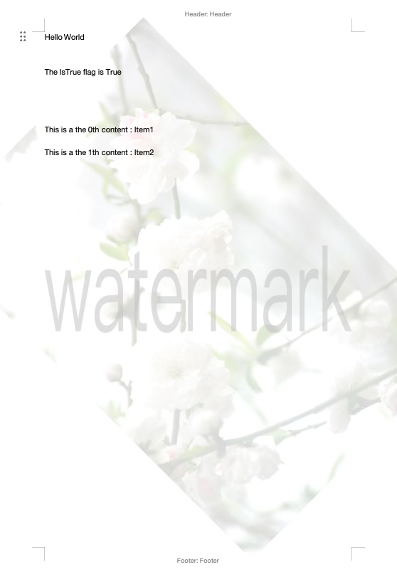

# docxr

[](https://goreportcard.com/report/github.com/otfot/docxr)
[](https://godoc.org/github.com/otfot/docxr)

`docxr` is a lightweight Go library for generating `.docx` Word documents from templates. It leverages Go's built-in `text/template` package, allowing you to use familiar template syntax directly within your Word documents.

This library is useful for generating reports, invoices, or any other document where the structure is fixed but the content is dynamic.

## Rendered Output Example

<table>
	<tr>
		<td align="center"></td>
		<td align="center"></td>
	</tr>
	<tr>
		<td align="center">before</td>
		<td align="center">after</td>
	</tr>
</table>

## Features

- **Go Template Syntax**: Use the full power of Go's `text/template` package, including control structures like `{{if .Condition}}` and `{{range .Items}}`, directly in your `.docx` file.
- **Headers and Footers**: Template rendering works for headers and footers, in addition to the main document body.
- **Automatic Tag Merging**: Intelligently merges template tags that Microsoft Word may split across separate internal XML elements (e.g., `<w:t>{{.Na</w:t>` and `<w:t>me}}</w:t>` are automatically combined into `{{.Name}}` before processing).
- **Flexible I/O**: Read templates from files, `io.Reader`, or byte slices, and write the output to files or any `io.Writer`.
- **Lightweight**: A minimal API with only one external dependency for XML parsing.

## Installation

```sh
go get github.com/otfot/docxr
```

## Examples

### Reading a Document From a File

This example reads a `.docx` file named `template.docx` from the disk.

```go
dx := docxr.NewDocx()
err := dx.ReadFromFile("template.docx")
if err != nil {
    log.Fatal(err)
}
```

### Reading a Document From a Byte Slice

This is useful if you have the `.docx` file's content in memory (e.g., loaded from a database or a web request).

```go
// templateBytes is a []byte containing the docx file content
dx := docxr.NewDocx()
err := dx.ReadFromBytes(templateBytes)
if err != nil {
    log.Fatal(err)
}
```

### Rendering the Template

Once a document is loaded, you can render it with your data. The data can be a `struct` or a `map[string]interface{}`. `docxr` uses Go's `text/template` engine.

Assume `template.docx` contains: `Hello, {{.Name}}!`

```go
data := struct{ Name string }{"World"}
err := dx.Render(data)
if err != nil {
    log.Fatal(err)
}
```

### Writing the Document to a File

After rendering, you can save the result to a new `.docx` file.

```go
err := dx.WriteToFile("output.docx")
if err != nil {
    log.Fatal(err)
}
```

### Writing the Document to an io.Writer

This allows streaming the output, for example, to an HTTP response.

```go
var buf bytes.Buffer
_, err := dx.WriteTo(&buf)
if err != nil {
    log.Fatal(err)
}
// buf now contains the bytes of the generated .docx file
```

### Complete Example: File to File

This example combines the steps above to perform a complete transformation.

```go
package main

import (
	"log"
	"github.com/otfot/docxr"
)

func main() {
	dx := docxr.NewDocx()

	// Read
	if err := dx.ReadFromFile("template.docx"); err != nil {
		log.Fatalf("Read failed: %v", err)
	}

	// Prepare data
	data := map[string]string{
		"Name": "John Doe",
	}

	// Render
	if err := dx.Render(data); err != nil {
		log.Fatalf("Render failed: %v", err)
	}

	// Write
	if err := dx.WriteToFile("output.docx"); err != nil {
		log.Fatalf("Write failed: %v", err)
	}
}
```

## How It Works

A `.docx` file is a zip archive containing a collection of XML files and other assets. `docxr` leverages this structure to provide its templating capabilities:

1.  **Unzip**: The input `.docx` file is read as a zip archive.
2.  **Find & Parse**: The library finds the core XML files that contain visible text (`document.xml`, `header1.xml`, etc.) and parses them.
3.  **Merge Tags**: It scans the parsed XML for text nodes and merges any template tags that have been split by the word processor. This is a crucial step that makes templating reliable.
4.  **Render**: The text content of each XML file is then processed as a Go `text/template`, and the provided data is rendered into it.
5.  **Re-zip**: The final rendered XML is placed back into the archive, and a new `.docx` file is written to the output stream.

## Acknowledgements

This project was inspired by and built upon the ideas from several excellent Go projects:

*   [fumiama/go-docx](https://github.com/fumiama/go-docx): Provided initial insights into DOCX structure and manipulation.
*   [tomwatkins1994/go-docx-template](https://github.com/tomwatkins1994/go-docx-template): Offered valuable approaches to templating within DOCX files.
*   [beevik/etree](https://github.com/beevik/etree): Its robust and easy-to-use XML parsing capabilities were fundamental to the development of `docxr`.
